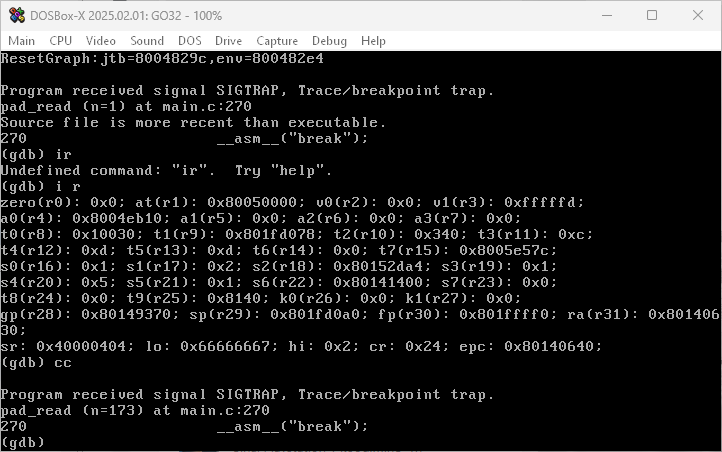

To use manual GDB trigger in NET Yaroze you can setup this patch

Sample project: \PSX\SAMPLE\CHECK

asm_break_patch.diff: presenting it here too

--- MAIN_orig.C
+++ MAIN.c
@@ -265,6 +265,10 @@
 {
 	u_long padd = PadRead(1);		/* Controller reading */
 
+	if (padd & PADR2) {  // if R2
+		// break in GDB upon R2 press, be sure to use 'cc' to get out of it
+		__asm__("break");
+	}
 	if (padd & PADLup)	n += 4;	/* Left cross key up */
 	if (padd & PADLdown)	n -= 4;	/* Left cross key down */

Essentially what is happening here is that if you hit R2 on joypad
it will use 'break' assembly instruction and GDB will pick it up if Yaroze in GDB mode

Making of patch:
busybox diff -u MAIN_orig.C MAIN.c > asm_break_patch.diff

Apply patch
busybox patch Main_test.c < asm_break_patch.diff

In gdb.ini add

define cc
  set $pc = $pc + 4
  continue
end

Once you hit R2 and get greeted break in gdb you can do stuff in debugger as you should
but to continue running use command 'cc' which will increase program counter of PSX otherwise
you will get stuck in endless loop

Create auto2 with contents:
local load main

hit 'siocons' and F2

C:\PSX\SAMPLE\CHECK>siocons
siocons -- PlayStation debug system console program
   for DTLH3000 1996/05/10 00:00:03
   type  F1   ----> display help
   when hung up try type  ESC
 I/O addr = 0x03F8, IRQ=4(vect=0x000C,8259=20)
 BAUDRATE = 115200

>>
Auto[6]: auto2
main [ .text] address:80140000-80140bdf size:000be0  000be0:    0sec.
main [.rdata] address:80140be0-80140cff size:000120  000120:    1sec.
main [ .data] address:80140d00-8014136f size:000670  000670:    1sec.
main [.sdata] address:80141370-801413ef size:000080  000080:    2sec.
  PC=801409e0, GP=80149370, SP=801ffff0

then 'rdb' and ESC

>>rdb
Loading Remote Debugger [cdrom:\MON\HSS.EXE;1]...done.
Exec Remote Debugger (epc:8008a800)
Terminate by user!

C:\PSX\SAMPLE\CHECK>

PS1 is now in debug mode and you can run gdb

C:\PSX\SAMPLE\CHECK>gdb
GDB is free software and you are welcome to distribute copies of it
 under certain conditions; type "show copying" to see the conditions.
There is absolutely no warranty for GDB; type "show warranty" for details.
GDB 4.15.1 (go32 --target mips-sony-psx),
Copyright 1995 Free Software Foundation, Inc.

Adding definitions for remote PSX debugging (See %HOME%/gdb.ini)

warning: Hit heuristic-fence-post without finding
warning: enclosing function for address 0x8008a840
This warning occurs if you are debugging a function without any symbols
(for example, in a stripped executable).  In that case, you may wish to
increase the size of the search with the `set heuristic-fence-post' command.

Otherwise, you told GDB there was a function where there isn't one, or
(more likely) you have encountered a bug in GDB.
0x8008a840 in GsNDIV ()
Loading section .text, size 0xbe0 vma 0x80140000
Loading section .rdata, size 0x120 vma 0x80140be0
Loading section .data, size 0x670 vma 0x80140d00
Loading section .sdata, size 0x80 vma 0x80141370
(gdb)

just hit 'run', and then R2 the SIGTAP is triggered

`c:/psx/sample/check\main' has changed; re-reading symbols.
Starting program: c:/psx/sample/check\main
ResetGraph:jtb=8004829c,env=800482e4

Program received signal SIGTRAP, Trace/breakpoint trap.
pad_read (n=1) at main.c:270
Source file is more recent than executable.
270                     __asm__("break");
(gdb)

you can now use i r for example to get PS1 CPU registers
and if you hit 'cc' the execution is passed back to program

(gdb) i r
zero(r0): 0x0; at(r1): 0x80050000; v0(r2): 0x0; v1(r3): 0xfffffd;
a0(r4): 0x8004eb10; a1(r5): 0x0; a2(r6): 0x0; a3(r7): 0x0;
t0(r8): 0x10030; t1(r9): 0x801fd078; t2(r10): 0x340; t3(r11): 0xc;
t4(r12): 0xd; t5(r13): 0xd; t6(r14): 0x0; t7(r15): 0x8005e57c;
s0(r16): 0x1; s1(r17): 0x2; s2(r18): 0x80152da4; s3(r19): 0x1;
s4(r20): 0x5; s5(r21): 0x1; s6(r22): 0x80141400; s7(r23): 0x0;
t8(r24): 0x0; t9(r25): 0x8140; k0(r26): 0x0; k1(r27): 0x0;
gp(r28): 0x80149370; sp(r29): 0x801fd0a0; fp(r30): 0x801ffff0; ra(r31): 0x801406
30;
sr: 0x40000404; lo: 0x66666667; hi: 0x2; cr: 0x24; epc: 0x80140640;
(gdb) cc

This is neat way to stop Yaroze programs at free will in debug mode without any
gdb usual delays upon conditional breakpoints e.g. break if something > 1234 or so on
